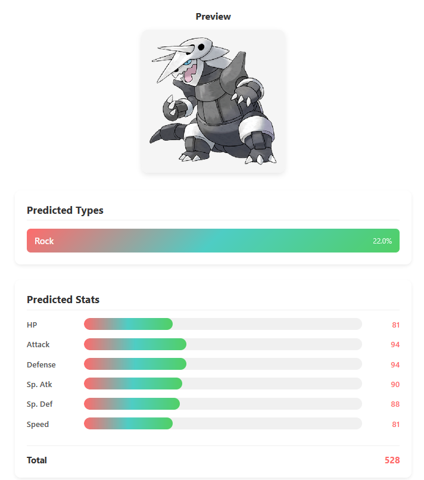
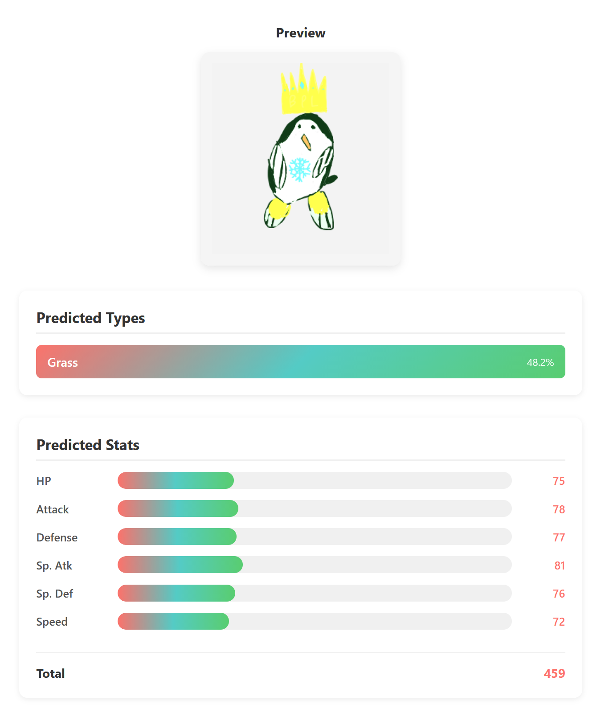
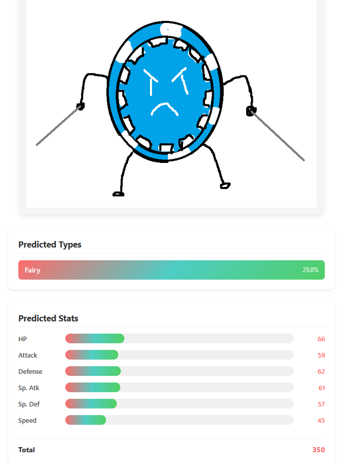

# Pokemon Type & Stats Predictor
CNN-based model that predicts Pokemon types and base stats from Fakemon, which is a term for any fake or custom created Pokemon. Demonstrates AWS deployment, Docker, and APIs.

A containerized machine learning API that predicts Pokémon types and base stats from images. The model is implemented in PyTorch, served via FastAPI, containerized with Docker, and deployed on AWS EC2.

**Frontend:** https://more-functional-fakemon.vercel.app  
**API Docs**: http://3.148.255.151/docs 

## Demo Results
Below are some example predictions from the model. Each screenshot shows the uploaded image and the model's predicted types and base stats.

### Example 1: Aggron
<table>
<tr>
<td width="50%">

</td>
<td width="50%">

**Predicted vs Intended**
**Types:**  
Predicted: Rock  
Intended: Rock / Steel

**Stats:**
| Stat | Predicted | Actual |
|------|-----------|--------|
| HP | 81 | 70 |
| Attack | 94 | 110 |
| Defense | 94 | 180 |
| Sp. Atk | 90 | 60 |
| Sp. Def | 88 | 60 |
| Speed | 81 | 50 |
| **BST** | **528** | **530** |
**Notes:** This sample shows how well predictions can be at times. The type prediction was monotype, likely due to the abundance of monotype pokemon, however it still properly predicted the rock type. Additionally, the model accurately determined attack and defense as Aggron's highest stats. Unfortunately, Aggron's stats are very polarized for game mechanics purposes (and because stats such as special attack and special defense are abstract) so it would be incredibly unlike to guess a defense of 180 or attack of 110. In spite of this, the BST the model predicted is still remarkably close to that of the actual Pokemon.

</td>
</tr>
</table>

### Example 2: Ice Penguin Fakemon
<table>
<tr>
<td width="50%">

</td>
<td width="50%">

**Predicted vs Intended**
**Types:**  
Predicted: Grass  
Intended: Ice

**Stats:**
| Stat | Predicted | Actual |
|------|-----------|--------|
| HP | 75 | 45 |
| Attack | 78 | 55 |
| Defense | 77 | 45 |
| Sp. Atk | 81 | 65 |
| Sp. Def | 76 | 45 |
| Speed | 72 | 75 |
| **BST** | **459** | **330** |

**Notes:** This sample shows how strongly the model favors color. While we can see visual design elements such as a penguin and a snowflake, the model has no way of identifying these relations with the ice type with its limited training data. However, the model does strongly link the grass type when green is a primary color in the image.

</td>
</tr>
</table>

### Example 3: Arbitrary Chip Design
<table>
<tr>
<td width="50%">

</td>
<td width="50%">

**Predicted vs Intended**
**Types:**  
Predicted: Fairy  
Intended: None

**Stats:**
| Stat | Predicted | Actual |
|------|-----------|--------|
| HP | 66 | N/A |
| Attack | 59 | N/A |
| Defense | 62 | N/A |
| Sp. Atk | 61 | N/A |
| Sp. Def | 57 | N/A |
| Speed | 45 | N/A |
| **BST** | **350** | **N/A** |

**Notes:** This sample was to test on an image created with no particular intention. The model seems to have guessed the fairy type with its common accent colors of blue and white with its overall round shape (azurill/marill/azumarill, jigglypuff, carbink, etc.) It's also interesting to note that the predicted BST is remarkably lower than that of the average Pokemon (~455).

</td>
</tr>
</table>

## Model Performance
### Type Prediction
- **Micro F1 Score:** 0.3773
- **Perfect Match:** 10.43%

#### Type Prediction Distribution
| Type      | Count | Percentage |
|-----------|-------|------------|
| Psychic   | 32    | 19.6%      |
| Water     | 29    | 17.8%      |
| Flying    | 27    | 16.6%      |
| Grass     | 25    | 15.3%      |
| Dark      | 17    | 10.4%      |
| Fairy     | 12    | 7.4%       |
| Fire      | 11    | 6.7%       |
| Bug       | 10    | 6.1%       |
| Steel     | 9     | 5.5%       |
| Poison    | 5     | 3.1%       |
| Ghost     | 4     | 2.5%       |
| Ice       | 3     | 1.8%       |
| Normal    | 1     | 0.6%       |
| Electric  | 1     | 0.6%       |
| Rock      | 1     | 0.6%       |
| Dragon    | 1     | 0.6%       |
| Fighting  | 0     | 0.0%       |
| Ground    | 0     | 0.0%       |

### Stat Prediction
- **MAE:** 22.36
- **RMSE:** 28.06

| Predicted Stat | Mean  | Std Dev |
|----------------|-------|---------|
| HP             | 72.61 | 6.10    |
| Attack         | 84.46 | 9.72    |
| Defense        | 81.46 | 6.80    |
| Sp. Atk        | 76.61 | 6.08    |
| Sp. Def        | 73.87 | 7.20    |
| Speed          | 72.55 | 8.55    |
**Predicted Total BST:** Mean = 461.55, Std Dev = 35.76

## Tech Stack
- **Model**: PyTorch CNN (4-layer architecture)
- **API**: FastAPI with automatic OpenAPI docs
- **Containerization**: Docker
- **Backend**: AWS EC2 (t2.micro)
- **Frontend**: React + Vercel
- **Tunnel**: Cloudflare for HTTPS

## Model Details
- **Architecture**: Custom CNN with separate heads for type and stat prediction
- **Training Data**: ~720 Pokemon images (Generations 1-6)
- **Input**: 128x128 RGB images
- **Output**: Multi-label type classification + 6 base stat regression

## Local Installation
Frontend is optional and a lightweight React app deployable on Vercel after editing `frontend/src/components/Predictor.js` fetch to endpoint.

### Docker Image
```bash
docker pull entroxx/more_functional_fakemon:latest
docker run -d -p 8000:8000 entroxx/more_functional_fakemon:latest
```

Visit `http://localhost:8000/docs` to test endpoints in Swagger UI.

### Local Development / Custom Training
Note that weights are not committed but may be found at:
- https://drive.google.com/file/d/1ms-bdnI7Hx-hht0-FQGOUP3Nh88ZSyhF/view?usp=sharing

Place file in root directory of folder.

```bash
git clone https://github.com/TaamimN/more-functional-fakemon.git
cd more-functional-fakemon
pip install -r requirements.txt
```

To train, evaluate model, or run the API you may simply run:
- `src/train.py` (note that no training data is committed)
- `src/evaluate.py`
- `src/api.py`

Note that you may wish to additionally install pytorch-cuda if using an nvidia gpu when training/evaluating and may regardless wish to edit `src/config.py`.

## API Reference
### `POST /predict`
Upload an image file to get predicted types and stats.

**Request:**
- `multipart/form-data`
  - `file`: Pokemon image (.png) (ideally transparent background)

**Response Example:**
```json
{
  "types": [
    {"type": "Water", "confidence": 0.95},
    {"type": "Flying", "confidence": 0.87}
  ],
  "stats": {
    "HP": 80,
    "Attack": 85,
    "Defense": 75,
    "Sp. Atk": 90,
    "Sp. Def": 70,
    "Speed": 110
  },
  "total_stats": 510
}
```

## Deployment Notes
- The backend runs in a Docker container on AWS EC2.
- Model weights are not committed to the repository and must be downloaded separately.
- The frontend is deployed independently on Vercel.
- The frontend supports mock responses for offline or demo-only usage.

## Model Limitations
The model faces several inherent challenges:

**Dataset Size**: Training on only 720 images limits the model's ability to generalize. Modern Pokemon and fan-created designs would improve coverage.
**Type Imbalance**: ~50% of Pokemon are monotype, causing the model to favor single-type predictions. The top 20 type combinations include 17 monotypes.
**Feature Learning**: The CNN primarily learns color-based patterns with limited shape understanding. This works reasonably for types (blue = Water) but struggles with stats, which don't correlate strongly with visual features.
**Design Philosophy**: Pokemon designs intentionally subvert expectations (some Pokemon base stat distribution is particularly polar, such as Shuckle), making visual-only prediction fundamentally difficult.

## Future Improvements
- Introduce new/modern Pokemon and finer tuning to avoid type combination / stat spread trends
- Utilize existing "Fakemon" created by various sources to expand the dataset
- Implement methods for identifying more complicated shapes and themes in designs
- Incorporate additional inputs such as names along with lexographical analysis

## Contributing
Project is currently only for demo purposes. Pull requests are welcome for retraining or improvements.

## License
MIT License, refer to LICENSE